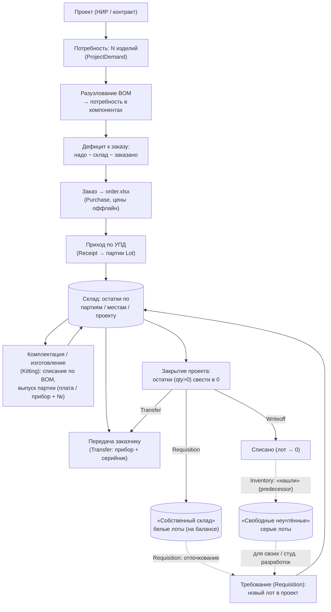

# ant-plm

Веб-приложение для управления жизненным циклом изделий (PLM) — для небольших
студенческих и научных команд, которые ведут НИР и мелкосерийное производство.

Идея: проект ограничен во времени (НИР на разработку изделия или контракт на
выпуск конкретного количества). PLM избавляет от ручного заполнения актов
комплектации и даёт ответ на вопросы: **сколько каких компонентов осталось, по
какому проекту они куплены, хватает ли их на сборку изделия и что делать с
остатками при закрытии проекта.**

## Возможности (MVP)

- Единый справочник номенклатуры (изделия и компоненты) и состав изделия (BOM).
- Закупки и приход по УПД, склад с учётом партий и мест хранения (ledger).
- Заказ под заданное количество изделий: разузлование BOM, расчёт дефицита
  (надо − склад − заказано) и экспорт `order.xlsx` для поставщиков.
- Акты комплектации образцов (автоматическое списание по BOM).
- Проекты со сквозным потоком: закупки → комплектация → передача → сверка
  балансов и решение по остаткам.

## Стек

Django + Django REST Framework · React + TypeScript (Vite) · MySQL/MariaDB.
Рассчитано на shared-хостинг (напр. reg.ru): без Celery/Redis, тяжёлые операции
синхронно, периодика через cron.

## Быстрый старт

> ⚠️ В разработке — раздел будет дополнен, когда сложится рабочая сборка.

```
# backend
# frontend
```

## Модель данных

> Эти диаграммы — источник правды по модели. Любое изменение схемы БД должно
> сразу отражаться здесь.

### Продуктовая схема (как это работает)



### Техническая схема (структура БД)

```mermaid
erDiagram
  ITEM ||--o{ BOMLINE : "как parent"
  ITEM ||--o{ BOMLINE : "как component"
  ITEM ||--o{ LOT : "партии"
  ITEM ||--o{ PURCHASELINE : ""
  ITEM ||--o{ PROJECTDEMAND : "target"
  ITEM ||--o{ KITTING : "target"
  ITEM ||--o{ KITTINGLINE : "component"

  SUPPLIER ||--o{ RECEIPT : ""

  LOCATION ||--o{ STOCKMOVEMENT : ""
  LOCATION ||--o{ KITTINGLINE : ""

  USER ||--o{ PURCHASE : "автор"
  USER ||--o{ RECEIPT : "автор"
  USER ||--o{ KITTING : "автор"
  USER ||--o{ TRANSFER : "автор"
  USER ||--o{ INVENTORY : "автор"
  USER ||--o{ WRITEOFF : "автор"
  USER ||--o{ REQUISITION : "автор"

  LOT ||--o{ STOCKMOVEMENT : ""
  LOT ||--o{ KITTINGLINE : ""
  LOT ||--o{ TRANSFERLINE : ""
  LOT ||--o{ WRITEOFFLINE : ""
  LOT ||--o{ REQUISITIONLINE : "source"
  LOT ||--o{ LOT : "predecessor (закрытие/отпочкование)"

  PROJECT ||--o{ PROJECTDEMAND : ""
  PROJECT ||--o{ LOT : "home (проект лота)"
  PROJECT ||--o{ PURCHASE : ""
  PROJECT ||--o{ RECEIPT : ""
  PROJECT ||--o{ KITTING : ""
  PROJECT ||--o{ TRANSFER : ""
  PROJECT ||--o{ INVENTORY : ""
  PROJECT ||--o{ WRITEOFF : ""
  PROJECT ||--o{ REQUISITION : "получатель"

  PURCHASE ||--o{ PURCHASELINE : ""
  PURCHASE ||--o{ RECEIPT : "nullable"
  RECEIPT ||--o{ LOT : "создаёт партии (поставка)"
  KITTING ||--o{ KITTINGLINE : ""
  KITTING ||--o{ LOT : "изготовление"
  TRANSFER ||--o{ TRANSFERLINE : ""
  INVENTORY ||--o{ LOT : "найденные партии"
  WRITEOFF ||--o{ WRITEOFFLINE : ""
  REQUISITION ||--o{ REQUISITIONLINE : ""
  REQUISITION ||--o{ LOT : "отпочкованные партии"
  LOCATION ||--o{ WRITEOFFLINE : ""
  LOCATION ||--o{ REQUISITIONLINE : ""

  ITEM {
    int id PK
    string code "артикул, uniq"
    string name
    string kind "изделие/компонент/материал"
    string uom "ед. изм."
    bool is_manufactured
    bool active
  }
  BOMLINE {
    int id PK
    int parent_id FK
    int component_id FK
    decimal qty
    string position "опц."
  }
  SUPPLIER {
    int id PK
    string name
    string inn
  }
  USER {
    int id PK
    string username
    string full_name
    bool is_active "деактивация вместо удаления (PROTECT)"
  }
  LOCATION {
    int id PK
    string code
    string name
    string kind
  }
  LOT {
    int id PK
    int item_id FK
    int project_id FK "home-проект (immutable)"
    int receipt_id FK "origin: поставка (nullable)"
    int kitting_id FK "origin: изготовление (nullable)"
    int inventory_id FK "origin: инвентаризация (nullable)"
    int requisition_id FK "origin: требование/отпочкование (nullable)"
    int predecessor_id FK "лот-предшественник при закрытии (nullable)"
    decimal unit_cost "цена закупки / себестоимость (снимок)"
    string received_name "название из УПД"
    string serial_number "заводской № (nullable, ручной текст)"
  }
  STOCKMOVEMENT {
    int id PK
    int lot_id FK "item и project выводятся из партии"
    int location_id FK
    string type "RECEIPT/ISSUE/RETURN/TRANSFER/ADJUSTMENT"
    decimal qty "со знаком"
    string source_type "УПД/акт/передача (обязателен)"
    int source_id "автор и дата — из документа"
    datetime created_at "технический штамп вставки"
  }
  PROJECT {
    int id PK
    string code
    string name
    string kind "внешний НИР/контракт | внутр. склад (белые) | внутр. списано (серые)"
    string status
    date started_at
    date closed_at "nullable"
  }
  PROJECTDEMAND {
    int id PK
    int project_id FK
    int target_item_id FK
    decimal qty
  }
  PURCHASE {
    int id PK
    int project_id FK
    int user_id FK "автор"
    string status "draft/sent/partial/received/cancelled"
    date date
    string note
  }
  PURCHASELINE {
    int id PK
    int purchase_id FK
    int item_id FK "uniq в рамках закупки"
    decimal qty "заказано"
  }
  RECEIPT {
    int id PK
    string number "УПД №"
    date date
    int supplier_id FK
    int purchase_id FK "nullable"
    int project_id FK
    int user_id FK "автор"
  }
  KITTING {
    int id PK
    int project_id FK
    int target_item_id FK
    int user_id FK "автор"
    decimal qty "кол-во образцов"
    date date
    string status
  }
  KITTINGLINE {
    int id PK
    int kitting_id FK
    int component_id FK
    int lot_id FK
    int location_id FK
    decimal qty
  }
  TRANSFER {
    int id PK
    int project_id FK
    int user_id FK "автор"
    date date
    string number "накладная №"
  }
  TRANSFERLINE {
    int id PK
    int transfer_id FK
    int lot_id FK "item выводится из партии"
    decimal qty
    string display_name "переопределяет received_name (nullable)"
  }
  INVENTORY {
    int id PK
    int project_id FK
    int user_id FK "автор"
    string number "акт инвентаризации №"
    date date
    string note
  }
  WRITEOFF {
    int id PK
    int project_id FK
    int user_id FK "автор"
    string number "акт списания №"
    date date
    string reason "причина"
  }
  WRITEOFFLINE {
    int id PK
    int writeoff_id FK
    int lot_id FK
    int location_id FK
    decimal qty
  }
  REQUISITION {
    int id PK
    int project_id FK "проект-получатель новых лотов"
    int user_id FK "автор"
    string number "требование №"
    date date
  }
  REQUISITIONLINE {
    int id PK
    int requisition_id FK
    int source_lot_id FK "откуда отпочковываем (project иной)"
    int location_id FK
    decimal qty
  }
```



## Ключевые принципы модели

- **Единый `Item`**: изделия и компоненты — одна сущность; изделие может состоять
  из изделий (рекурсивный BOM через `BomLine`).
- **`Lot` — главная учётная единица.** Хранит цену закупки (`unit_cost`) и
  название из УПД (`received_name`); поставщик и дата берутся через `Receipt`.
  Каждый приход = новый `Lot` (заказы уникальны), отдельной строки документа нет.
- **`Lot` не возникает «из воздуха» — всегда есть origin-документ:** поставка
  (`Receipt`), изготовление (`Kitting`), инвентаризация (`Inventory` — «найденные»
  партии) или отпочкование (`Requisition` — новый лот, отделённый от исходного).
  **Ровно один origin задан** (инвариант — через `clean()`/констрейнт); явные FK по
  типу (FK-целостность + удобные join'ы для покрытия закупки и генеалогии).
- **Себестоимость произведённого лота (`unit_cost`) — снимок.** При создании
  `Kitting` поле префиллится суммой `Σ (line.qty × component_lot.unit_cost)`
  (один уровень — у детей свой `unit_cost` уже накоплен), дальше живёт статично и
  правится руками (добавить стоимость работ, посчитанную оффлайн). Пересчёт —
  ручная кнопка-помощник «обновить по акту изготовления» (однопроходная, на
  движке разузлования): осознанное действие, **затирает** ручную наценку, поэтому
  показывает дифф и предупреждает о компонентах без цены. Автопересчёта нет;
  стоимость всплывает снизу вверх через снимки. Для покупных лотов цена ручная (из
  счёта). Живой отчёт «себестоимость по материалам» при желании строится поверх
  ledger как проверка, не подменяя снимок.
- **Заводской номер (`Lot.serial_number`)** — ручной текст, не ключ, nullable.
  Присваивается только конечным изделиям (приборам), которые мы производим;
  промежуточные партии (например, батч печатных плат) — без номера. Норма —
  «серийник = экземпляр» (`Lot` на один прибор), но поле текстовое: при
  необходимости один `Lot` несёт диапазон («05–25»). Один акт изготовления может
  породить как 30 партий-приборов (по номеру на каждую), так и одну партию на 30 —
  документооборот выбирается по месту. **Генеалогия прибора («паспорт»)
  выводится разузлованием цепочки** `Lot →(origin) Kitting →(lines) Lot → …`
  (тот же движок, что и BOM); отдельной сущности под это нет.
- **Склад — неизменяемый ledger** (`StockMovement`): двигается **только по
  `Lot`** (`item` и `project` выводятся из партии); остаток = сумма движений в
  разрезе партии / места / проекта. **Движение не существует без документа**
  (`source_type` + `source_id` обязательны): приход (УПД), акт, передача.
- **Авторство — на документах, не на движении.** Документы редки и всегда
  заведены сотрудником, поэтому автор и дата берутся из документа, а не дублируются
  в движении. `user` (→ аккаунт `User`, колонка `user_id`) есть у всех документов
  (`Purchase`/`Receipt`/`Kitting`/`Transfer`/`Inventory`/`Writeoff`/`Requisition`) —
  личная ответственность за учёт. Пользователей деактивируем (`is_active`), не
  удаляем (`on_delete=PROTECT`). Физически `User` — стандартная Django-модель
  (`auth_user`); зарезервировано лишь голое `USER`, а имя таблицы и колонка
  `user_id` не конфликтуют.
- **Передача — только по `Lot`** (`Transfer` + `TransferLine`): отдаём заказчику
  готовое железо, `item` выводится из партии. Так передача конкретного прибора
  однозначно тянет его заводской номер, а движение фиксируется в ledger
  (`StockMovement`, `source=передача`). Строка передачи допускает `qty > 1` и
  своё `display_name` (переопределяет `received_name` в накладной — напр. «Прибор
  X. Заводские номера 05–25»). КД и прочий документооборот — оффлайн, вне PLM.
- **Проект — свойство лота (`Lot.project`), не движения.** Лот живёт в одном
  проекте от рождения (origin-документ) до закрытия; `movement.project` выводится
  из лота, межпроектного переноса одного лота не бывает. `project` обязателен на
  документах — «общего через `NULL`» больше нет, его заменяют **внутренние
  проекты** (`Project.kind`): «Собственный склад» (белые, на балансе) и «Свободные
  неучтённые компоненты» (серые, списанные).
- **Отпочкование лота (`Requisition` = требование).** Комплектование из
  «Собственного склада» в проект — это не перетег `project`, а **отделение**:
  `−qty` (ISSUE) на исходном лоте (живёт дальше) + рождение **нового лота** в
  проекте-получателе (`origin=Requisition`, `predecessor=исходный лот`, qty
  сохраняется). Обычно выписывают ровно сколько надо → исходный лот уходит в ноль
  (для этого и нужен «Собственный склад» — не копить мелкие остаточные лоты).
  «Постановка на баланс» при закрытии — тот же документ в обратную сторону (лот
  проекта → новый белый лот).
- **Закрытие проекта — закрывающими документами, не правкой.** Каждый невыбранный
  лот (`qty>0`) сводится в 0: передачей заказчику (`Transfer`), списанием
  (`Writeoff`) или постановкой на баланс (`Requisition` → «Собственный склад»).
  Серый путь = `Writeoff` (списали с проекта) → позже `Inventory` («нашли» как
  неучтённое) с `predecessor` на списанный лот. Команда работает спринтами:
  «обнуляется» в конце проекта, но не теряет контроль над остатками (белые/серые).
- **Закупки — лёгкий `Purchase`.** Закупка = список «что купить» (экспорт в
  `order.xlsx`); поставщик и цены — оффлайн, в системе их нет. Закупка
  «разрешается» в приходы: `PurchaseLine` закрывается одним или несколькими `Lot`
  через цепочку `Lot → Receipt → Purchase` (поставка 100 = 60 + 40 = две партии —
  норма). Привязка партии к строке выводится по `(purchase, item)`, поэтому пара
  `(purchase, item)` в `PurchaseLine` уникальна. Статус отражает покрытие
  (`draft → sent → partial → received`).
- **«Что ещё не заказано» и сверка балансов — отчёты поверх ledger**, а не
  отдельные мутабельные таблицы:
  `ещё заказать = надо (BOM×потребность) − склад (Lot) − заказано (открытые PurchaseLine)`.

## Лицензия

См. [LICENSE](LICENSE).
