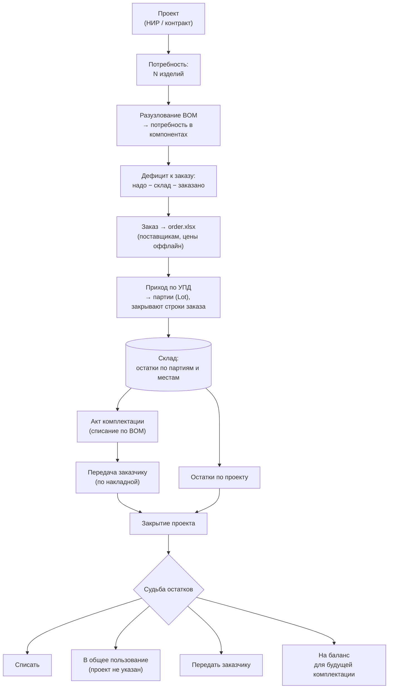
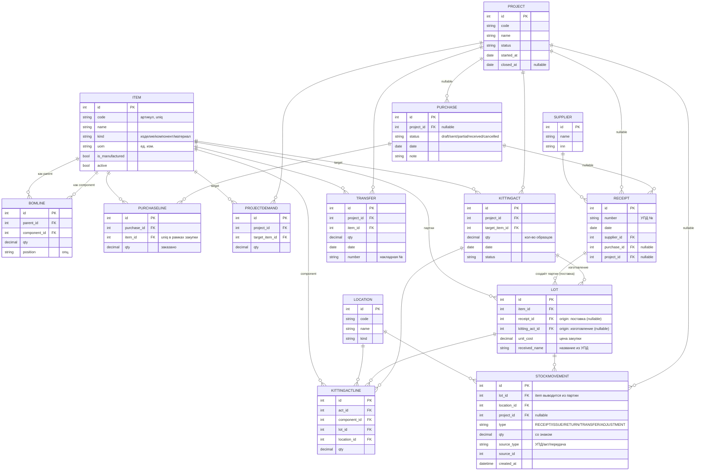

# ant-plm

Веб-приложение для управления жизненным циклом изделий (PLM) — для небольших
студенческих и научных команд, которые ведут НИР и мелкосерийное производство.

Идея: проект ограничен во времени (НИР на разработку изделия или контракт на
выпуск конкретного количества). PLM избавляет от ручного заполнения актов
комплектации и даёт ответ на вопросы: **сколько каких компонентов осталось, по
какому проекту они куплены, хватает ли их на сборку изделия и что делать с
остатками при закрытии проекта.**

## Возможности (MVP)

- Единый справочник номенклатуры (изделия и компоненты) и состав изделия (BOM).
- Закупки и приход по УПД, склад с учётом партий и мест хранения (ledger).
- Заказ под заданное количество изделий: разузлование BOM, расчёт дефицита
  (надо − склад − заказано) и экспорт `order.xlsx` для поставщиков.
- Акты комплектации образцов (автоматическое списание по BOM).
- Проекты со сквозным потоком: закупки → комплектация → передача → сверка
  балансов и решение по остаткам.

## Стек

Django + Django REST Framework · React + TypeScript (Vite) · MySQL/MariaDB.
Рассчитано на shared-хостинг (напр. reg.ru): без Celery/Redis, тяжёлые операции
синхронно, периодика через cron.

## Быстрый старт

> ⚠️ В разработке — раздел будет дополнен, когда сложится рабочая сборка.

```
# backend
# frontend
```

## Модель данных

> Эти диаграммы — источник правды по модели. Любое изменение схемы БД должно
> сразу отражаться здесь.

### Продуктовая схема (как это работает)



### Техническая схема (структура БД)



## Ключевые принципы модели

- **Единый `Item`**: изделия и компоненты — одна сущность; изделие может состоять
  из изделий (рекурсивный BOM через `BomLine`).
- **`Lot` — главная учётная единица.** Хранит цену закупки (`unit_cost`) и
  название из УПД (`received_name`); поставщик и дата берутся через `Receipt`.
  Каждый приход = новый `Lot` (заказы уникальны), отдельной строки документа нет.
- **`Lot` не возникает «из воздуха» — всегда есть origin-акт:** поставка
  (`Receipt`), изготовление (`KittingAct` = акт комплектации/изготовления) или
  инвентаризация (акт — планируется). Ровно один origin задан.
- **Склад — неизменяемый ledger** (`StockMovement`): двигается **только по
  `Lot`** (`item` выводится из партии); остаток = сумма движений в разрезе
  партии / места / проекта.
- **Проект — nullable** в движениях и закупках: `project IS NULL` = «общее
  пользование». Решение по остаткам при закрытии проекта (списать / в общее /
  заказчику / на баланс) — это просто новые движения, перепривязывающие или
  списывающие количество.
- **Закупки — лёгкий `Purchase`.** Закупка = список «что купить» (экспорт в
  `order.xlsx`); поставщик и цены — оффлайн, в системе их нет. Закупка
  «разрешается» в приходы: `PurchaseLine` закрывается одним или несколькими `Lot`
  через цепочку `Lot → Receipt → Purchase` (поставка 100 = 60 + 40 = две партии —
  норма). Привязка партии к строке выводится по `(purchase, item)`, поэтому пара
  `(purchase, item)` в `PurchaseLine` уникальна. Статус отражает покрытие
  (`draft → sent → partial → received`).
- **«Что ещё не заказано» и сверка балансов — отчёты поверх ledger**, а не
  отдельные мутабельные таблицы:
  `ещё заказать = надо (BOM×потребность) − склад (Lot) − заказано (открытые PurchaseLine)`.

## Лицензия

См. [LICENSE](LICENSE).
